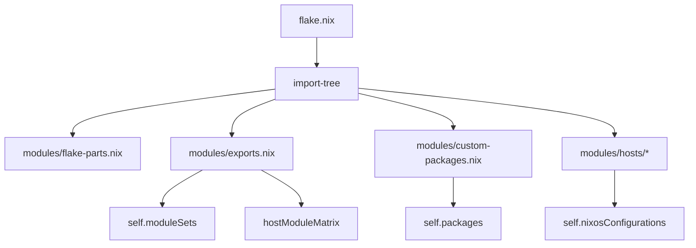

# ❄️ nixconf

> **Declarative NixOS flake for my machines** — `flake-parts`, `import-tree`, thin host modules, custom packages, ephemeral-root support, Hyprland/DankMaterialShell desktops, and a public VPS service edge.

<div align="center">

| Channel | Shell | Hosts | Root model | Package surface |
| --- | --- | ---: | --- | --- |
| `nixos-26.05` + `nixos-unstable` | DankMaterialShell on graphical hosts | 3 active | Impermanent / persisted state | `modules/_pkgs/*.nix` → `self.packages` |

</div>

> [!NOTE]
> This is a personal fleet configuration, not a generic NixOS distribution. Reusable modules exist where they keep hosts small and maintenance predictable.

---

## 🧭 Contents

- [🗺️ Current topology](#️-current-topology)
- [🧱 Flake architecture](#-flake-architecture)
- [🧩 Host composition model](#-host-composition-model)
- [🖥️ Desktop stack](#️-desktop-stack)
- [🌐 Server and public services](#-server-and-public-services)
- [🧊 Impermanence](#-impermanence)
- [🔐 Secrets](#-secrets)
- [📦 Custom packages](#-custom-packages)
- [🧰 Scripts and local development](#-scripts-and-local-development)
- [🛡️ VPN proxy](#️-vpn-proxy)
- [🚧 Rebuild wrapper](#-rebuild-wrapper)
- [🧪 Verification checklist](#-verification-checklist)
- [📝 License](#-license)

---

## 🗺️ Current topology

```text
flake.nix
└─ import-tree [ ./modules ./secrets.nix ]
   ├─ modules/exports.nix             grouped exports + hostModuleMatrix
   ├─ modules/flake-parts.nix         systems, pkgs construction, flake apps
   ├─ modules/custom-packages.nix     auto-loads modules/_pkgs/*.nix
   ├─ modules/lib/                    self.lib helpers
   ├─ modules/common/                 base, networking, impermanence, keymap
   ├─ modules/nixos/terminal/         shared terminal/server profile and services
   ├─ modules/nixos/desktop/          graphical profile and Hyprland/DMS stack
   ├─ modules/nixos/scripts/          general, Quickshell, Bun/TypeScript scripts
   ├─ modules/programmes/             shell/editor/app configuration
   ├─ modules/user/                   user-level helpers such as Hyprland config
   └─ modules/hosts/                  concrete machines
```

### 🏠 Active hosts

| Host | Role | Profile flags | User | Main responsibilities |
| --- | --- | --- | --- | --- |
| `legion5i` | Primary graphical laptop | `terminal`, `desktop`, `laptop` | `matrix` | Hyprland/DankMaterialShell, CUDA/Nvidia, OBS, Obsidian, HDMI-CEC TV remote media controls, OpenSnitch, local VPN proxy, ntfy, Unison |
| `macbook` | T2 graphical laptop | `terminal`, `desktop`, `laptop` | `matrix` | Hyprland/DankMaterialShell, Apple T2 support, T2 firmware bundle, OpenSnitch, ntfy, local VPN proxy, Unison |
| `main_vps` | Headless service host | `terminal`, `server` | `server` | Traefik edge, Dokploy, CLIProxyAPI, Bifrost, OmniRoute, CPA Usage Keeper, services-auth-gateway, ntfy, homepage, VPN proxy |

> [!TIP]
> `modules/hosts/ionos_vps/` exists as a directory but is not exported as a current `nixosConfiguration`.

---

## 🧱 Flake architecture

`flake.nix` stays small and delegates structure to imported modules.

| Surface | Current owner | Purpose |
| --- | --- | --- |
| Inputs | `flake.nix` | `nixpkgs` on `nixos-26.05`, `nixpkgs-unstable`, hardware, DMS, disko, Flatpak, nix-index-database, llm-agents, nix-dokploy |
| Per-system outputs | `modules/flake-parts.nix` | Supported systems, `pkgs` construction, temporary overrides, `apps.rebuild` |
| Module exports | `modules/exports.nix` | Grouped module sets and evaluated `hostModuleMatrix` |
| Local packages | `modules/custom-packages.nix` | Auto-exposes `modules/_pkgs/*.nix` through `self.packages` |
| Shared library | `modules/lib/` | Persistence, generators, config-file helpers, git rendering, nixpkgs policy, user package paths |

### 📤 Export surface

| Export | Contents |
| --- | --- |
| `self.moduleSets.profiles` | `common`, `terminal`, `desktop` |
| `self.moduleSets.features` | audio, bluetooth, HDMI-CEC, Firefox, DMS, Hyprland, OBS, Obsidian, Qt, Syncthing, TLP, tuigreet, VSCodium |
| `self.moduleSets.services` | CLIProxyAPI, Bifrost, OmniRoute, CPA Usage Keeper, services-auth-gateway, monitoring, nix, OpenCode, tailscale, Unison, virtualisation, VPN proxy, cockpit |
| `self.moduleSets.hosts` | `main_vps`, `legion5i`, `macbook` |
| `hostModuleMatrix` | Evaluated profile/feature/service matrix consumed by `rebuild.sh matrix` |



---

## 🧩 Host composition model

Hosts import reusable modules, then set `preferences` and service toggles. Reusable settings should flow through `config.preferences` and `self.lib`; host-name branches are reserved for real host exceptions.

<details open>
<summary><strong>Profile flags</strong></summary>

```nix
preferences.profiles.terminal.enable = true;
preferences.profiles.desktop.enable = true;
preferences.profiles.laptop.enable = true;
preferences.profiles.server.enable = true;
```

</details>

<details open>
<summary><strong>Feature flags tracked by the matrix</strong></summary>

```nix
preferences.obs.enable = true;
preferences.obsidian.enable = true;
preferences.hardware.tlp.enable = true;
```

</details>

<details open>
<summary><strong>Service flags tracked by the matrix</strong></summary>

```nix
services.cliproxyapi.enable = true;
services.cpa-usage-keeper.enable = true;
services.omniroute.enable = true;
services.dokploy.enable = true;
services.homepage-monitor.enable = true;
services.hypridle.enable = true;
services.opensnitch.enable = true;
services.netdata-monitor.enable = true;
services.unison-sync.enable = true;
services.vpn-proxy.enable = true;
services.cockpit-managed.enable = true;
services.docker-compose-stacks.stacks.<stack>.enable = true;
```

`services.cockpit-managed` runs the stock Cockpit socket with normal PAM login. Use `cockpit-admin` and the generated password-store entry at `system/cockpit-admin`; direct exposure still relies on the closed firewall or the shared edge auth route.

</details>

---

## 🖥️ Desktop stack

Graphical hosts import `modules/nixos/desktop/default.nix`, which extends the terminal profile.

| Area | Module path | Notes |
| --- | --- | --- |
| 🐚 Shell | `modules/nixos/desktop/dank-material-shell.nix` | DankMaterialShell is active. It replaces Waybar, Hyprlock, Hyprsunset, qs-launcher, qs-notifications, and old shell surfaces. |
| 🪟 Compositor | `modules/nixos/desktop/hyprland/` + `modules/user/hyprland.nix` | Hyprland/UWSM config, bindings, idle hooks. DMS IPC handles shell actions. |
| 🔊 Audio | `modules/nixos/desktop/system/audio.nix` | PipeWire/WirePlumber, MPD, player control. |
| 📺 HDMI-CEC | `modules/nixos/desktop/system/hdmi-cec.nix` | Optional `preferences.hardware.hdmiCec.enable`; configures `/dev/cec*` adapters as playback devices so TV remote media keys reach Linux input. |
| 🌍 Browser | `modules/nixos/desktop/firefox/firefox.nix` | LibreWolf/Firefox policy and user config. |
| ✍️ Editor/IDE | `modules/programmes/fresh.nix`, `modules/nixos/desktop/vscodium/` | Fresh as terminal editor; VSCodium with declarative extensions/theme. |
| 🧱 Firewall | `modules/nixos/desktop/opensnitch.nix` | OpenSnitch daemon/UI, eBPF process monitor, nftables backend, mutable persisted config/rules with `services.opensnitch.mutableRules` seed files. |
| 🧰 Apps | `modules/nixos/desktop/flatpaks/`, `obs.nix`, `obsidian.nix`, `qt.nix`, `tuigreet.nix` | Desktop app set, Flatpak integration, display greeter, Qt theming. |

### ⌨️ Shell boundary

| Owned by DMS | Retained `qs-*` tools |
| --- | --- |
| Bar, dock, spotlight launcher, notifications, lock, night controls, power menu, idle inhibitor UI | `qs-dmenu`, `qs-passmenu`, `qs-wallpaper`, and unrelated utility scripts until explicitly migrated |

---

## 🌐 Server and public services

`main_vps` imports the terminal profile, cockpit, nix-dokploy, disko, and the public edge module.

| Path | Purpose |
| --- | --- |
| `modules/hosts/main_vps/configuration.nix` | Enables Dokploy, CLIProxyAPI, Bifrost, OmniRoute, CPA Usage Keeper, VPN proxy, ntfy, homepage, Unison. |
| `modules/hosts/main_vps/my-website.nix` | Traefik edge, wildcard ACME, protected dashboard routing, services-auth-gateway integration. |
| `modules/hosts/main_vps/remote-unlock.nix` | Initrd network and SSH unlock on public port 22 before stage-2 sshd. |
| `modules/nixos/terminal/services-auth-gateway.nix` | Shared auth gateway service module. |
| `modules/nixos/terminal/bifrost.nix` | Imports upstream Bifrost flake module and patched upstream fixed-output hashes; host config seeds config.json at service start. |
| `modules/nixos/terminal/docker-compose-stacks.nix` | Discovers `modules/docker/compose/<stack>/*.yaml` and creates per-stack systemd `docker compose up/down` units. |
| `modules/nixos/terminal/monitoring/` | Homepage and Netdata modules. |

```text
:80/:443 Traefik + wildcard ACME
├─ apex/www/openclaw/dokploy app routes -> dokploy-traefik on 127.0.0.1:81 where needed
├─ cliproxyapi.<domain>  -> CLIProxyAPI on 127.0.0.1:8317
├─ bifrost.<domain>      -> Bifrost on 127.0.0.1:20129; proxies to CLIProxyAPI
├─ omniroute.<domain>    -> OmniRoute on 127.0.0.1:20128
├─ cpa-usage.<domain>   -> CPA Usage Keeper
└─ dashboard/cockpit/vpn/portainer/mongo -> services-auth-gateway on 127.0.0.1:41276
```

> [!IMPORTANT]
> Baikal/DAV-style routes bypass shared auth where the service protocol requires it.

### Local magic DNS

`modules/nixos/terminal/monitoring/homepage.nix` derives local Homepage links, bookmarks, `/etc/hosts` aliases, and port-80 reverse proxies from one `localServices` table. Only services enabled on the current host get a magic name. The original `localhost:<port>` listeners stay open for scripts and direct debugging. Magic-name proxies preserve Host/X-Forwarded headers, cookies, redirects, and WebSocket upgrades; they also strip upstream cross-origin isolation headers that break HTTP-only shortcut origins such as `qbittorrent/`.

| Magic DNS | Target localhost port | Enabled where | Notes |
| --- | ---: | --- | --- |
| `dashboard/` | 8082 | all terminal/profile hosts with Homepage enabled | Homepage itself. |
| `cockpit/` | 9090 | `main_vps`, `legion5i`, `macbook` | Cockpit system dashboard. |
| `acp-chat/` | 8732 | terminal/profile hosts | Local ACP browser UI. |
| `vpn/` | 10802 | `main_vps`, `legion5i`, `macbook` | VPN proxy management UI. |
| `cliproxyapi/` | 8317 | `main_vps` | Links to `/management.html`. |
| `omniroute/` | 20128 | `main_vps` | OmniRoute gateway/dashboard. |
| `cpa-usage/` | 8080 | `main_vps` | CLIProxyAPI usage dashboard. |
| `dokploy/` | 3000 | `main_vps` | Dokploy UI; Dokploy Traefik still uses 127.0.0.1:81. |
| `portainer/` | 9000 | hosts with the `portainer` compose stack | Docker/Compose management. |
| `qbittorrent/` | 8088 | `legion5i`, `macbook` | Gluetun-bound qBittorrent WebUI. |
| `mongo/` | 41275 | `main_vps` | Mongo Express admin UI. |

`portainer` is enabled fleet-wide from `modules/docker/compose/portainer/compose.yaml` and seeds the initial admin password from `system/portainer-admin`. `gluetun-qbittorrent` is enabled on `macbook` and `legion5i` only; qBittorrent shares Gluetun's network namespace, binds its WebUI at `127.0.0.1:8088`, stores credentials in `personal/qbittorrent-webui`, persists config under `/var/lib/qbittorrent-vpn`, and downloads to cache-persisted `~/Torrents`.

---

## 🧊 Impermanence

Root is wiped on boot. Persist only state that must survive.

| Layer | Path | Responsibility |
| --- | --- | --- |
| NixOS module | `modules/common/impermanence.nix` | Filesystem/persistence wiring |
| Library | `modules/lib/_internal/persistence.nix` | Helpers for persisted files/directories |
| Apps/services | `impermanence.*` near the module using the path | Service/app-owned state paths |

Rules:

- Critical state goes to persistent directories.
- Regenerable data belongs in cache paths.
- Global user state is limited to broad directories and credentials; app paths live beside the programme/service module that uses them.
- Heavy or reinstallable data is cache-tier: `~/Downloads`, `~/Torrents`, `~/.bun`, `~/.npm`, `~/.paseo`, Orca speech models/logs/browser caches, `/var/log`, and `/var/lib/systemd`.
- Terminal/desktop apps split mutable XDG state explicitly: `gh` auth and Orca workspace/session state are persisted; OpenCode, Limux, GitHub CLI, and editor caches stay cache-tier. Orca keeps one persisted Electron profile directory to avoid per-file impermanence races with first-run profile writes.

---

## 🔐 Secrets

```text
pass -> rebuild.sh SECRETS_MAP/SECRET_FIELDS -> generated secrets.nix -> self.secrets
```

| Rule | Why |
| --- | --- |
| `secrets.nix` is generated and uncommitted | Keeps secret material out of git |
| Modules consume `self.secrets.NAME` | Keeps secret access declarative and searchable |
| Credential field parsing requires `SECRET_FIELDS` | Prevents multi-field pass entries from silently replacing raw secrets |
| Use `path:.#...` for eval/builds | Includes generated and untracked files |
| Use `--skip-secrets` only for secret-independent validation | Avoids false confidence when regenerated secrets are required |

Useful debug paths:

```bash
HOST=legion5i ./rebuild.sh --debug --skip-secrets validate
HOST=main_vps ./rebuild.sh --debug matrix
```

---

## 📦 Custom packages

Every top-level `modules/_pkgs/*.nix` file is auto-exposed through `modules/custom-packages.nix`.

| Policy | Current value |
| --- | --- |
| Default package universe | Stable `nixpkgs` |
| Edge package universe | `nixpkgs-unstable`, selected centrally in `edgePackages` |
| Package shape | Normal `callPackage` derivations; avoid ambient `{ unstable, ... }` parameters |
| Update workflow | Package-specific update support where upstream release shape permits it |

### ⚡ Unstable-routed packages

```text
acp-chat
cliproxyapi
omniroute
openchamber-web
limux
```

### 📚 Notable local package set

```text
acp-chat, antigravity-manager, aptos-fonts, brave-origin, cake-wallet-flatpak,
cliproxyapi, cpa-usage-keeper, daisyui-mcp, dogecoin, iloader, limux,
mattpocock-skills, niri-screen-time, omniroute, omp-desktop, openchamber-web,
orca, patchright, playwright-cli, quickshell-docs-markdown, seance,
pass-credential, services-auth-gateway, sideloader, stdio-to-ws, update-pkgs,
wallpapers, waydroid-script, waydroid-total-spoof
```

> [!TIP]
> When adding packages, use the repo's custom-package workflow: derivation under `modules/_pkgs`, update support where useful, `nix build --no-link path:.#<name>`, then host exclusions only where the package should not exist.

---

## 🧰 Scripts and local development

Root `package.json` is workspace/editor glue. The real TypeScript/Bun workspace lives in `modules/nixos/scripts/bunjs`.

```bash
bun install
bun run build:vpn-proxy-web
bun run typecheck:scripts
```

| Area | Contents |
| --- | --- |
| 🛡️ VPN proxy | SOCKS5, HTTP CONNECT, resolver, namespace cleanup, web UI, tests |
| 👤 User tools | passmenu, lyricsctl/synced lyrics, music search/local library, pomodoro, checklist, git-sync debug, btrfs backup |
| 🤖 MCP servers | markdown lint, QML lint, Quickshell docs, image generation helpers |

Packaged outputs do not depend on checkout-local `node_modules`; local installs are for editor tooling and interactive development.

---

## 🛡️ VPN proxy

The VPN proxy lives under `modules/nixos/scripts/bunjs/proxy/` and is exposed by `modules/nixos/scripts/bunjs/proxy/service.nix`.

```text
client
├─ SOCKS5 localhost:10800  username selects VPN slug or random
└─ HTTP CONNECT localhost:10801
   -> resolver/cache
   -> per-VPN network namespace
   -> OpenVPN + nftables kill-switch
   -> idle cleanup
```

| Property | Behavior |
| --- | --- |
| Selection | SOCKS5 username selects a VPN slug or random route |
| Isolation | Per-VPN network namespace |
| Leak handling | nftables kill-switch blocks fallback egress |
| State | Runtime/tmpfs-oriented |

---

## 🚧 Rebuild wrapper

`rebuild.sh` is the supported entry point. It writes secrets, evaluates the host matrix, and calls the relevant NixOS action.

> [!WARNING]
> Agents must not run rebuild/switch/deploy/install/rollback/generation-changing commands. `HOST=<host> ./rebuild.sh validate` is the allowed rebuild wrapper validation path.

### ✅ Validation examples

```bash
HOST=legion5i ./rebuild.sh --debug --skip-secrets validate
HOST=main_vps ./rebuild.sh --debug matrix
```

### 🧑‍💻 User-operated mutation examples

```bash
HOST=macbook ./rebuild.sh secrets
HOST=legion5i ./rebuild.sh switch
HOST=macbook ./rebuild.sh build
HOST=legion5i ./rebuild.sh dry-run
HOST=main_vps ./rebuild.sh deploy root@192.168.1.100
HOST=macbook ./rebuild.sh install root@192.168.1.100
HOST=legion5i ./rebuild.sh rollback
HOST=legion5i ./rebuild.sh generations
```

---

## 🔁 Common changes

### ➕ Add a host

1. Create `modules/hosts/<name>/configuration.nix` plus hardware/disko files as needed.
2. Export `flake.nixosConfigurations.<name>` and `flake.nixosModules.<name>Host`.
3. Set `preferences.hostName`, `preferences.user.username`, and explicit profile flags.
4. Add feature/service toggles in the host file.
5. Update `modules/exports.nix` host exports and matrix selectors if the new host introduces tracked capabilities.
6. Update `AGENTS.md` Navigation / Live Topology and this README in the same change.

### 🌍 Add a service route

1. Add or update the service module/options.
2. Enable the service in `modules/hosts/main_vps/configuration.nix`.
3. Add the route in `modules/hosts/main_vps/my-website.nix`.
4. Persist required service state.
5. Update the live topology docs in `AGENTS.md` and the server section here.

### 🔑 Add a secret

1. Add the entry to `SECRETS_MAP` in `rebuild.sh`.
2. If the pass entry is a credential record, add the required field to `SECRET_FIELDS`; otherwise it is loaded as raw `pass show` output.
3. Insert the value into `pass`.
4. Consume it as `self.secrets.NAME`.
5. Validate with `HOST=<host> ./rebuild.sh --debug validate` when secrets are available, or `--skip-secrets` only for paths that do not need regenerated secrets.

### 📦 Add a package

1. Add `modules/_pkgs/<name>.nix` with `pname` matching the exported package name.
2. Prefer stable nixpkgs; add to `edgePackages` only when the pinned stable channel cannot build or run it correctly.
3. Add update support where the upstream release model permits it.
4. Build with `nix build --no-link path:.#<name>`.
5. Add host exclusions only when a package cannot run or should not exist on a host class.

---

## 🧪 Verification checklist

Before merging non-trivial changes:

```bash
# Formatting
nix run nixpkgs#nixfmt-tree -- --ci .

# Flake/module validation
HOST=legion5i ./rebuild.sh --debug --skip-secrets validate
HOST=macbook ./rebuild.sh --debug --skip-secrets validate
HOST=main_vps ./rebuild.sh --debug --skip-secrets validate

# TypeScript scripts, when touched
bun run typecheck:scripts
```

> [!CAUTION]
> `nix flake check` is not proof that runtime service routing, desktop bindings, or VPN isolation works. Use targeted runtime checks for those surfaces.

---

## 📝 License

GPL-3.0-only. See [`LICENCE`](LICENCE).
