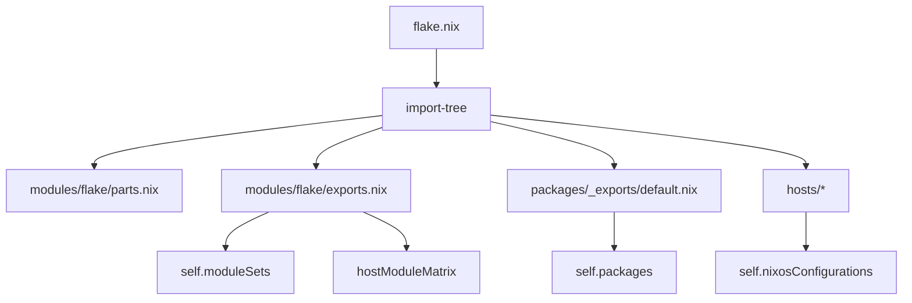

# ❄️ nixconf

> **Declarative NixOS flake for my machines** — `flake-parts`, `import-tree`, thin host modules, custom packages, ephemeral-root support, KDE Plasma desktops, and a public VPS service edge.

<div align="center">

| Channel                          | Shell                           |    Hosts | Root model                    | Package surface                                                                |
| -------------------------------- | ------------------------------- | -------: | ----------------------------- | ------------------------------------------------------------------------------ |
| `nixos-26.05` + `nixos-unstable` | KDE on `legion5i` and `macbook` | 3 active | Impermanent / persisted state | `packages/*/package.nix` + `external-packages/*/package.nix` → `self.packages` |

</div>

> [!NOTE]
> This is a personal fleet configuration, not a generic NixOS distribution. Reusable modules exist where they keep hosts small and maintenance predictable.

---

## 🧭 Contents

- [🗺️ Current topology](#️-current-topology)
- [🧱 Flake architecture](#-flake-architecture)
- [🧩 Host composition model](#-host-composition-model)
- [🖥️ Desktop stack](#️-desktop-stack)
- [🌐 Server and public services](#-server-and-public-services)
- [🧊 Impermanence](#-impermanence)
- [🔐 Secrets](#-secrets)
- [📦 Custom packages](#-custom-packages)
- [🧰 Scripts and local development](#-scripts-and-local-development)
- [🛡️ VPN proxy](#️-vpn-proxy)
- [❓ Command help](#command-help)
- [🚧 Rebuild wrapper](#-rebuild-wrapper)
- [🧪 Verification checklist](#-verification-checklist)
- [📝 License](#-license)

---

## 🗺️ Current topology

```text
flake.nix
└─ import-tree
   ├─ lib/default.nix                         flat self.lib *.nix helpers
   ├─ packages/_exports/default.nix           auto-loads package derivations
   ├─ packages/*/{module,package}.nix         package-owned modules/multi-output packages
   ├─ external-packages/*/module.nix          service modules for packaged upstream projects
   ├─ programmes/                             wrappers/configuration for upstream tools
   ├─ modules/                                reusable NixOS profiles/features/services
   ├─ hosts/                                  concrete machines
   └─ secrets.nix                             generated by rebuild.sh
```

### 🏠 Active hosts

| Host       | Role                     | Profile flags                   | User     | Main responsibilities                                                                                                                                                              |
| ---------- | ------------------------ | ------------------------------- | -------- | ---------------------------------------------------------------------------------------------------------------------------------------------------------------------------------- |
| `legion5i` | Primary graphical laptop | `terminal`, `desktop`, `laptop` | `matrix` | KDE Plasma 6, CUDA/Nvidia, OBS, Obsidian, HDMI-CEC TV remote media controls, OpenSnitch, local VPN proxy, ntfy, Unison, manual btrbk `/persist/system` backups                     |
| `macbook`  | T2 graphical laptop      | `terminal`, `desktop`, `laptop` | `matrix` | KDE Plasma 6, Apple T2 support, T2 firmware bundle, OpenSnitch, ntfy, local VPN proxy, Unison, manual btrbk `/persist/system` backups                                              |
| `main_vps` | Headless service host    | `terminal`, `server`            | `server` | Traefik edge, Dokploy, CLIProxyAPI, Bifrost, OmniRoute, CPA Usage Keeper, services-auth-gateway, ntfy, homepage, generated docs, VPN proxy, manual btrbk `/persist/system` backups |

---

## 🧱 Flake architecture

`flake.nix` stays small and delegates structure to imported modules.

| Surface            | Current owner                                                      | Purpose                                                                                                                                                                         |
| ------------------ | ------------------------------------------------------------------ | ------------------------------------------------------------------------------------------------------------------------------------------------------------------------------- |
| Inputs             | `flake.nix`                                                        | `nixpkgs` on `nixos-26.05`, `nixpkgs-unstable`, `nix-wrapper-modules`, hardware, disko, Flatpak, nix-index-database, llm-agents, nix-dokploy                                    |
| Per-system outputs | `modules/flake/parts.nix`                                          | Supported systems, `pkgs` construction, temporary overrides, `apps.rebuild`                                                                                                     |
| Module exports     | `modules/flake/exports.nix`                                        | Grouped module sets and evaluated `hostModuleMatrix`                                                                                                                            |
| Local packages     | `packages/_exports/default.nix`, package-owned `package.nix` files | Auto-exposes single-derivation package directories and imports multi-output package modules; command wrappers are exported individually from their owning package               |
| Package updates    | `external-packages/update-pkgs/workflow.nix`                       | Declarative package sets, updater modes, safe smoke arguments, custom-updater bindings, and manual reasons; missing coverage warns during the check and when `update-pkgs` runs |
| Programme wrappers | `programmes/<name>/`                                               | Portable configured upstream tools built with the `BirdeeHub/nix-wrapper-modules` input                                                                                         |
| Repository audits  | `packages/repo-audits/package.nix`                                 | Opt-in `persist-audit` and `nix-unused-audit` commands; flake checks protect directory, updater, and installed-package export contracts                                         |
| Shared library     | `lib/`                                                             | Flat `*.nix` persistence, generators, config-file helpers, git rendering, nixpkgs policy, user package paths                                                                    |

Architecture rule: root architecture directories contain owner subdirectories only; do not add first-level implementation files there. `lib/` is the exception and stays flat `*.nix` helpers. Every `packages/<name>/` and `external-packages/<name>/` directory contains `package.nix`; every `programmes/<name>/` directory contains `module.nix` or `package.nix`. Package scripts depend on the narrowest relevant exported command rather than an aggregate bundle. `docs/` first-level entries are section directories containing `.md`/`.mdx`; JS/TS Docusaurus app code belongs in `packages/bunjs-docs/`, not under `docs/`.

### Repository audits

These commands build and run on a Nix-enabled Linux system without global installation or profile activation:

```bash
nix run path:.#persist-audit
nix run path:.#nix-unused-audit
nix run path:.#nix-unused-audit -- --strict

nix build --no-link path:.#checks.x86_64-linux.repository-architecture
nix build --no-link path:.#checks.x86_64-linux.update-pkgs-workflow-coverage
nix build --no-link path:.#checks.x86_64-linux.installed-package-references
```

`persist-audit` locates persistence/cache declarations. `nix-unused-audit` runs [deadnix](https://github.com/astro/deadnix) and [statix](https://github.com/oppiliappan/statix); `--strict` makes unused bindings fail. The architecture check enforces directory-only roots for `docs/`, `packages/`, `external-packages/`, and `programmes/`; the update workflow check warns for external package directories missing an updater mode. The installed-package check forces every host's `environment.systemPackages` derivation paths, catching stale auto-exported package attributes during `nix flake check` rather than a later system rebuild.

### 📤 Export surface

| Export                     | Contents                                                                                                                                                                   |
| -------------------------- | -------------------------------------------------------------------------------------------------------------------------------------------------------------------------- |
| `self.moduleSets.profiles` | `common`, `terminal`, `desktop`                                                                                                                                            |
| `self.moduleSets.features` | audio, bluetooth, HDMI-CEC, Firefox, KDE, OBS, Obsidian, Syncthing, TLP, VSCodium                                                                                          |
| `self.moduleSets.services` | CLIProxyAPI, Bifrost, OmniRoute, CPA Usage Keeper, services-auth-gateway, generated docs, monitoring, nix, OpenCode, tailscale, Unison, virtualisation, VPN proxy, cockpit |
| `self.moduleSets.hosts`    | `main_vps`, `legion5i`, `macbook`                                                                                                                                          |
| `hostModuleMatrix`         | Evaluated profile/feature/service matrix consumed by `rebuild.sh matrix`                                                                                                   |


```mermaid
flowchart TD
  F[flake.nix] --> IT[import-tree]
  IT --> FP[modules/flake/parts.nix]
  IT --> EX[modules/flake/exports.nix]
  IT --> CP[packages/_exports/default.nix]
  IT --> HM[hosts/*]
  CP --> PKG[self.packages]
  EX --> SETS[self.moduleSets]
  EX --> MATRIX[hostModuleMatrix]
  HM --> NC[self.nixosConfigurations]
```

---

## 🧩 Host composition model

Hosts import reusable modules, then set `preferences` and service toggles. Reusable settings should flow through `config.preferences` and `self.lib`; host-name branches are reserved for real host exceptions.

<details open>
<summary><strong>Profile flags</strong></summary>

```nix
preferences.profiles.terminal.enable = true;
preferences.profiles.desktop.enable = true;
preferences.profiles.laptop.enable = true;
preferences.profiles.server.enable = true;
```

</details>

<details open>
<summary><strong>Feature flags tracked by the matrix</strong></summary>

```nix
preferences.obs.enable = true;
preferences.obsidian.enable = true;
preferences.hardware.tlp.enable = true;
```

</details>

<details open>
<summary><strong>Service flags tracked by the matrix</strong></summary>

```nix
services.cliproxyapi.enable = true;
services.cpa-usage-keeper.enable = true;
services.omniroute.enable = true;
services.dokploy.enable = true;
services.nixconf-docs.enable = true;
services.homepage-monitor.enable = true;
services.opensnitch.enable = true;
services.netdata-monitor.enable = true;
services.unison-sync.enable = true;
services.vpn-proxy.enable = true;
services.cockpit-managed.enable = true;
services.docker-compose-stacks.stacks.<stack>.enable = true;
```

`services.cockpit-managed` runs the stock Cockpit socket with normal PAM login. Use `cockpit-admin` and the generated password-store entry at `system/cockpit-admin`; direct exposure still relies on the closed firewall or the shared edge auth route.

</details>

---

## 🖥️ Desktop stack

Graphical hosts import `modules/desktop/default.nix`, which extends the terminal profile. `legion5i` and `macbook` both enable the KDE Plasma stack with `preferences.kde.enable`.

| Area               | Module path                                                          | Notes                                                                                                                                                                                                      |
| ------------------ | -------------------------------------------------------------------- | ---------------------------------------------------------------------------------------------------------------------------------------------------------------------------------------------------------- |
| 🐚 KDE session     | `modules/desktop/kde.nix`                                            | Plasma 6 via Plasma Login Manager, KDE portal, KWallet, Qt pinentry/askpass, KDE polkit agent, mutable user Plasma config, persisted Plasma state/cache split. Active on `legion5i` and `macbook`.         |
| 🔊 Audio           | `modules/desktop/system/audio.nix`                                   | PipeWire/WirePlumber, MPD, player control.                                                                                                                                                                 |
| 💾 Removable media | `modules/desktop/default.nix`, `modules/desktop/kde.nix`             | KDE uses Plasma/Solid/udisks2 integration and KDE polkit prompts.                                                                                                                                          |
| 📺 HDMI-CEC        | `modules/desktop/system/hdmi-cec.nix`                                | Optional `preferences.hardware.hdmiCec.enable`; configures `/dev/cec*` adapters as playback devices so TV remote media keys reach Linux input.                                                             |
| 🌍 Browser         | `modules/desktop/firefox/firefox.nix`, `modules/desktop/default.nix` | LibreWolf is the default system/xdg browser.                                                                                                                                                               |
| ✍️ Editor/IDE      | `programmes/fresh/module.nix`, `modules/desktop/vscodium/`           | Fresh as terminal editor; VSCodium with declarative extensions/theme and an explicit system-profile Git executable.                                                                                        |
| 🧱 Firewall        | `modules/desktop/opensnitch.nix`, `docs/operations/opensnitch.md`    | OpenSnitch daemon/UI, eBPF process monitor, nftables backend, advanced typed `services.opensnitch.mutableRules`, curated declarative allow/reject rules, and an authenticated `opensnitch-bypass` wrapper. |
| 🧰 Apps            | `modules/desktop/flatpaks/`, `obs.nix`, `obsidian.nix`               | Desktop app set, Flatpak integration, OBS, and Obsidian.                                                                                                                                                   |

### 🧊 KDE impermanence boundary

KDE is deliberately not managed with Plasma keybind/theme declarations. User choices made in System Settings persist through the impermanence module instead:

| Tier  | Paths                                                                                                                                                                                                                             | Why                                                                                                          |
| ----- | --------------------------------------------------------------------------------------------------------------------------------------------------------------------------------------------------------------------------------- | ------------------------------------------------------------------------------------------------------------ |
| State | `.config/kdeglobals`, `.config/kglobalshortcutsrc`, `.config/kwinrc`, `.config/plasma-org.kde.plasma.desktop-appletsrc`, `.config/plasmashellrc`, `.local/share/kwalletd`, `.local/share/plasma`, `.local/share/user-places.xbel` | Plasma shell, KWin, shortcuts, KWallet, widgets, launchers, and places are user-owned mutable configuration. |
| Cache | `.cache/plasma-svgelements`, `.cache/plasmashell`, `.cache/qmlcache`, `.cache/thumbnails`, `wallpaper`                                                                                                                            | Rebuildable rendering/index caches and local wallpaper selector cache.                                       |

Important utility commands are installed directly (`kitty`, `librewolf`, `qs-passmenu`, `qs-vpn`, `toggle-lyrics-overlay`, `voxtype`, audio helpers, etc.) so Plasma shortcuts can be assigned imperatively in KDE Settings without wrapper indirection. Screenshot/recording/zoom/window actions use KDE's built-in Spectacle/KWin tooling.

References: [NixOS KDE wiki](https://wiki.nixos.org/wiki/KDE), [KDE UserBase configuration files](https://userbase.kde.org/KDE_System_Administration/Configuration_Files), [nixpkgs Plasma 6 module](https://github.com/NixOS/nixpkgs/blob/nixos-26.05/nixos/modules/services/desktop-managers/plasma6.nix).

---

## 🌐 Server and public services

`main_vps` imports the terminal profile, cockpit, nix-dokploy, disko, and the public edge module.

| Path                                         | Purpose                                                                                                                         |
| -------------------------------------------- | ------------------------------------------------------------------------------------------------------------------------------- |
| `hosts/main_vps/configuration.nix`           | Enables Dokploy, CLIProxyAPI, Bifrost, OmniRoute, CPA Usage Keeper, VPN proxy, ntfy, homepage, generated docs, Unison.          |
| `hosts/main_vps/my-website.nix`              | Traefik edge, wildcard ACME, protected dashboard routing, services-auth-gateway integration.                                    |
| `hosts/main_vps/remote-unlock.nix`           | Initrd network and SSH unlock on public port 22 before stage-2 sshd.                                                            |
| `packages/bunjs-docs/module.nix`             | Builds `docs/` with Docusaurus during rebuild and serves the static site.                                                       |
| `packages/services-auth-gateway/module.nix`  | Shared auth gateway service module.                                                                                             |
| `modules/terminal/bifrost.nix`               | Imports upstream Bifrost flake module and patched upstream fixed-output hashes; host config seeds config.json at service start. |
| `modules/terminal/docker-compose-stacks.nix` | Discovers `modules/terminal/docker/compose/<stack>/*.yaml` and creates per-stack systemd `docker compose up/down` units.        |
| `modules/terminal/monitoring/`               | Homepage and Netdata modules.                                                                                                   |

```text
:80/:443 Traefik + wildcard ACME
├─ apex/www/openclaw/dokploy app routes -> dokploy-traefik on 127.0.0.1:81 where needed
├─ cliproxyapi.<domain>  -> CLIProxyAPI on 127.0.0.1:8317
├─ bifrost.<domain>      -> Bifrost on 127.0.0.1:20129; proxies to CLIProxyAPI
├─ omniroute.<domain>    -> OmniRoute on 127.0.0.1:20128
├─ docs.<domain>         -> generated Docusaurus docs on 127.0.0.1:8090
├─ cpa-usage.<domain>   -> CPA Usage Keeper
└─ dashboard/cockpit/vpn/portainer/mongo -> services-auth-gateway on 127.0.0.1:41276
```

> [!IMPORTANT]
> Baikal/DAV-style routes bypass shared auth where the service protocol requires it.

### Local magic DNS

`modules/terminal/monitoring/homepage.nix` derives local Homepage links, public edge cards, fleet bookmarks, `/etc/hosts` aliases, and port-80 reverse proxies from one `serviceCatalog` table. Card descriptions always include a `· :<port>` badge; the UI uses the Nix Cyberpunk Electric Dark theme. Only services enabled on the current host get a magic name. The original `localhost:<port>` listeners stay open for scripts and direct debugging. Magic-name proxies preserve Host/X-Forwarded headers, cookies, redirects, and WebSocket upgrades; they also strip upstream cross-origin isolation headers that break HTTP-only shortcut origins such as `qbittorrent/`.

| Magic DNS      | Target localhost port | Enabled where                                    | Notes                                                |
| -------------- | --------------------: | ------------------------------------------------ | ---------------------------------------------------- |
| `dashboard/`   |                  8082 | all terminal/profile hosts with Homepage enabled | Homepage itself.                                     |
| `docs/`        |                  8090 | all terminal/profile hosts                       | Generated Docusaurus docs from `docs/`.              |
| `cockpit/`     |                  9090 | `main_vps`, `legion5i`, `macbook`                | Cockpit system dashboard.                            |
| `vpn/`         |                 10802 | `main_vps`, `legion5i`, `macbook`                | VPN proxy management UI.                             |
| `cliproxyapi/` |                  8317 | `main_vps`                                       | Links to `/management.html`.                         |
| `omniroute/`   |                 20128 | `main_vps`                                       | OmniRoute gateway/dashboard.                         |
| `cpa-usage/`   |                  8080 | `main_vps`                                       | CLIProxyAPI usage dashboard.                         |
| `dokploy/`     |                  3000 | `main_vps`                                       | Dokploy UI; Dokploy Traefik still uses 127.0.0.1:81. |
| `portainer/`   |                  9000 | hosts with the `portainer` compose stack         | Docker/Compose management.                           |
| `qbittorrent/` |                  8088 | `legion5i`, `macbook`                            | Gluetun-bound qBittorrent WebUI.                     |
| `mongo/`       |                 41275 | `main_vps`                                       | Mongo Express admin UI.                              |

`portainer` is enabled fleet-wide from `modules/terminal/docker/compose/portainer/compose.yaml` and seeds the initial admin password from `system/portainer-admin`. `gluetun-qbittorrent` is enabled on `macbook` and `legion5i` only; qBittorrent shares Gluetun's network namespace, binds its WebUI at `127.0.0.1:8088`, stores credentials in `personal/qbittorrent-webui`, persists config under `/var/lib/qbittorrent-vpn`, and downloads to cache-persisted `~/Torrents`.

---

## 🧊 Impermanence

Root is wiped on boot. Persist only state that must survive.

| Layer         | Path                                            | Responsibility                          |
| ------------- | ----------------------------------------------- | --------------------------------------- |
| NixOS module  | `modules/common/impermanence.nix`               | Filesystem/persistence wiring           |
| Library       | `lib/persistence.nix`                           | Helpers for persisted files/directories |
| Apps/services | `impermanence.*` near the module using the path | Service/app-owned state paths           |

Rules:

- Critical state goes to persistent directories.
- Regenerable data belongs in cache paths.
- Global user state is limited to broad directories and credentials; app paths live beside the programme/service module that uses them.
- Heavy or reinstallable data is cache-tier: `~/Downloads`, `~/Torrents`, `~/.bun`, `~/.npm`, `/var/log`, and `/var/lib/systemd`.
- Terminal/desktop apps split mutable XDG state explicitly: `gh` auth is persisted; OpenCode, GitHub CLI, and editor caches stay cache-tier.
- GUI deletes route to the global XDG trash instead of checkout-local `.Trash-*`: `modules/common/impermanence.nix` sets `allowTrash = true` on persisted bind mounts and persists `~/.local/share/Trash` in `/persist/cache` so VSCodium, Dolphin, and GIO clients can trash files from `~/nixconf` without polluting the repository root.

### Manual btrbk backups

All terminal-profile hosts install `btrbk` and the `btrbk-persist-system` wrapper from `modules/terminal/btrbk.nix`. The config is generated at `/etc/btrbk/persist-system.conf` and is intentionally manual; no timer is enabled.

```bash
sudo btrbk-persist-system
sudo btrbk-persist-system --yes  # non-interactive creation of the missing BTRFS-BACKUPS root after safety checks
# Equivalent low-level command after creating the target directory:
sudo btrbk -c /etc/btrbk/persist-system.conf run
```

| Setting              | Default                                                                                                        |
| -------------------- | -------------------------------------------------------------------------------------------------------------- |
| Source subvolume     | `/persist/system`                                                                                              |
| Local snapshots      | `/persist/.btrbk-snapshots`                                                                                    |
| External drive label | `preferences.btrbkPersistSystem.externalDriveLabel = "EXTERNAL DATA DRIVE"`                                    |
| Target root          | `/run/media/<user>/<drive label>/BTRFS-BACKUPS/<host>-<8 hex chars>/`                                          |
| Backup names         | `backup.YYYYMMDDThhmmss±zzzz` (`timestamp_format long-iso`)                                                    |
| Retention            | keep every target backup for `60d`; keep only the latest local snapshot unless needed for an incremental chain |

The 8-character target suffix is generated once during activation and persisted in `/var/lib/btrbk/persist-system-target-code`, so impermanent-root reboots keep using the same target path. The wrapper checks that `/persist/system` is a Btrfs subvolume, verifies the removable drive mountpoint is mounted as Btrfs, prompts before first creating `BTRFS-BACKUPS`, creates the per-host target directory, then runs btrbk. Override the drive label per host with:

```nix
preferences.btrbkPersistSystem.externalDriveLabel = "My Backup Disk";
```

---

## 🔐 Secrets

```text
pass -> rebuild.sh SECRETS_MAP/SECRET_FIELDS -> generated secrets.nix -> self.secrets
```

| Rule                                                        | Why                                                                   |
| ----------------------------------------------------------- | --------------------------------------------------------------------- |
| `secrets.nix` is generated and uncommitted                  | Keeps secret material out of git                                      |
| Modules consume `self.secrets.NAME`                         | Keeps secret access declarative and searchable                        |
| Credential field parsing requires `SECRET_FIELDS`           | Prevents multi-field pass entries from silently replacing raw secrets |
| Use `path:.#...` for eval/builds                            | Includes generated and untracked files                                |
| Use `--skip-secrets` only for secret-independent validation | Avoids false confidence when regenerated secrets are required         |

Useful debug paths:

```bash
HOST=legion5i ./rebuild.sh --debug --skip-secrets validate
HOST=main_vps ./rebuild.sh --debug matrix
```

---

## 📦 Custom packages

Every `packages/*/package.nix` and `external-packages/*/package.nix` derivation is auto-exposed through `packages/_exports/default.nix`.

| Policy                   | Current value                                                                  |
| ------------------------ | ------------------------------------------------------------------------------ |
| Default package universe | Stable `nixpkgs`                                                               |
| Edge package universe    | `nixpkgs-unstable`, selected centrally in `edgePackages`                       |
| Package shape            | Normal `callPackage` derivations; avoid ambient `{ unstable, ... }` parameters |
| Update workflow          | Package-specific update support where upstream release shape permits it        |

### ⚡ Unstable-routed packages

```text
cliproxyapi
omniroute
openchamber-web
```

### 📚 Exported package directories

| Root                 | Directories                                                                                                                               | Notes                                                                                                                                                                     |
| -------------------- | ----------------------------------------------------------------------------------------------------------------------------------------- | ------------------------------------------------------------------------------------------------------------------------------------------------------------------------- |
| `packages/`          | `bunjs-*`, `lyricsctl`, `pass-credential`, `qs-menus`, `repo-audits`, `services-auth-gateway`                                             | In-repo software. Each Bun command/service owns its source, manifest, lockfile, and Nix derivation; only cohesive command families such as `bunjs-vpn-proxy` group files. |
| `external-packages/` | `cliproxyapi`, `cpa-usage-keeper`, `omniroute`, `openchamber-web`, `update-pkgs`, `wallpapers`, `waydroid-script`, `waydroid-total-spoof` | Packaged upstream projects plus the repo-local `update-pkgs` workflow. `cpa-usage-keeper` also exposes `cpa-usage-keeper-web` for update hash refreshes.                  |

> [!TIP]
> When adding packages, use the repo's custom-package workflow: derivation under `packages/<name>/package.nix` for in-repo software or `external-packages/<name>/package.nix` for external sources, update support where the upstream release model permits it, `nix build --no-link path:.#<name>`, then host exclusions only where the package should not exist. External packages without an automatic update shape must be listed as `manual` in `external-packages/update-pkgs/workflow.nix`; otherwise `checks.update-pkgs-workflow-coverage` and `update-pkgs` warn.

---

## 🧰 Scripts and local development

Root `package.json` defines Bun workspaces for every custom package. Install once at the repository root for local TypeScript diagnostics, Prettier, MarkdownLint, and package development; the generated root `bun.lock` pins all declared dependencies.

```bash
bun install --frozen-lockfile
bun run build:vpn-proxy-web
bun run test:vpn-proxy
```

| Area           | Contents                                                                                                         |
| -------------- | ---------------------------------------------------------------------------------------------------------------- |
| 🛡️ VPN proxy   | SOCKS5, HTTP CONNECT, resolver, namespace cleanup, web UI, tests                                                 |
| 👤 User tools  | passmenu, lyricsctl/synced lyrics, music search/local library, pomodoro, checklist, git-sync debug, btrfs backup |
| 🤖 MCP servers | markdown lint, QML lint, Quickshell docs, image generation helpers                                               |

Packaged outputs do not depend on checkout-local `node_modules`; per-package local installs are for editor tooling and interactive development only.

The docs app keeps `packages/bunjs-docs/package-lock.json` committed because `packages/bunjs-docs/package.nix` consumes that lockfile for reproducible Nix builds. The package copies root `docs/` beside the Docusaurus app and sets `NIXCONF_DOCS_ROOT=./docs`, so a sandboxed build reads the staged content rather than an invalid checkout-relative path. Root Bun workspace installation supplies editor TypeScript diagnostics and local Docusaurus commands.

---

## 🛡️ VPN proxy

The VPN proxy lives under `packages/bunjs-vpn-proxy/` and is exposed by `packages/bunjs-vpn-proxy/module.nix`.

```text
client
├─ SOCKS5 localhost:10800  username selects VPN slug or random
└─ HTTP CONNECT localhost:10801
   -> resolver/cache
   -> per-VPN network namespace
   -> OpenVPN + nftables kill-switch
   -> idle cleanup
```

| Property      | Behavior                                           |
| ------------- | -------------------------------------------------- |
| Selection     | SOCKS5 username selects a VPN slug or random route |
| Isolation     | Per-VPN network namespace                          |
| Leak handling | nftables kill-switch blocks fallback egress        |
| State         | Runtime/tmpfs-oriented                             |

---

## 🚧 Rebuild wrapper

`rebuild.sh` is the supported entry point. The terminal profile also exposes it as
`rebuild` (alias: `r`), so it works from any directory without relying on a
checkout-relative path. It writes secrets, evaluates the host matrix, and calls
the relevant NixOS action.

## Command help

Every enabled Nixconf module or package can append a record to
`preferences.commandHelp.commands`. The shared command-help module merges those
records for the evaluated host, rejects duplicate command or alias names, writes
`/etc/nixconf/help.json`, and installs the exported `help` package. This keeps
the index host-specific: a desktop-only command is absent on `main_vps`, while
an enabled service's CLI appears with the service.

```bash
# Formatted output in an interactive terminal; h is the zsh alias.
help
h

# Plain output for logs or pipes, or an explicit less view.
help --plain
help --pager

# Test the exported package with any compatible JSON document.
nix run path:.#help -- --plain --docs ./help.json
```

The standalone package accepts `--docs FILE` or `--docs-json JSON`; otherwise it
uses `NIXCONF_HELP_DOCS` (the host sets this to `/etc/nixconf/help.json`) and then
`NIXCONF_HELP_DOCS_JSON`.

> [!WARNING]
> Agents must not run rebuild/switch/deploy/install/rollback/generation-changing commands. `HOST=<host> ./rebuild.sh validate` is the allowed rebuild wrapper validation path.

### ✅ Validation examples

```bash
# All repository checks, with five independent lanes running in parallel.
bun install --frozen-lockfile
./rebuild.sh --no-notify lint

# Validation runs the same linting lanes alongside `nix flake check` by default.
HOST=legion5i ./rebuild.sh --debug --skip-secrets validate
HOST=main_vps ./rebuild.sh --debug matrix

# Use only when lint is intentionally out of scope for this evaluation.
HOST=legion5i ./rebuild.sh --debug --skip-secrets --skip-lint validate
```

### 🔎 Repository lint

`./rebuild.sh lint` keeps every diagnostic lane independently visible and waits for all of them before returning. Bootstrap the pinned root Prettier and MarkdownLint CLI dependencies with `bun install --frozen-lockfile` once per checkout. It checks tracked files only, so ignored build directories and local editor state cannot change the result:

| Lane           | Scope                                                                                      | Failure contract                                                                            |
| -------------- | ------------------------------------------------------------------------------------------ | ------------------------------------------------------------------------------------------- |
| OpenCode LSP   | Tracked `.nix`, `.sh`, `.bash`, and `.zsh`; eight bounded workers preserve per-file output | Server errors and LSP error diagnostics fail; warnings remain visible                       |
| Nix formatting | Repository tree through `nixfmt-tree -- --ci .`                                            | Any Nix formatting drift fails                                                              |
| TypeScript     | Every tracked `.ts` through temporary, non-emitting `tsc` project configs                  | Any compiler diagnostic fails; `.tsx` is intentionally outside the requested `.ts` contract |
| Prettier       | Tracked formatter-managed JSON, CSS, TypeScript, and TSX sources                           | Formatting drift fails; the Prettier cache makes repeated checks faster                     |
| Markdown       | Tracked `README.md` and `docs/` Markdown under [`.markdownlint.json`](.markdownlint.json)  | Any enabled Markdown rule violation fails                                                   |

The TypeScript lane uses the pinned `nixpkgs#typescript` compiler and temporary, non-emitting project configs to type-check every tracked `.ts` file. Root Bun workspaces install each package's declared dependencies once; root `@types/bun` and `@types/node` provide the shared Bun/Node runtime declarations. The checkout and source files remain untouched. `validate` runs this command in parallel with `nix flake check`; pass `--skip-lint` only when the caller explicitly needs flake evaluation without repository linting.

### 🤖 Model catalog state

[`packages/models/`](packages/models/) is the sole checkout-owned model catalog and selection state. `models sync` updates `packages/models/models.json`; model-group and preset commands update its sibling JSON state files. `models sync-config` derives the mutable OpenCode, OMO Slim, and OMP runtime configuration from that package-owned state without fetching models. The obsolete `modules/nixos/terminal/opencode/` location is rejected by the command to prevent a second writable catalog.

```bash
# Refresh the reviewed catalog from the selected gateway.
models sync

# Regenerate local application configurations from packages/models/.
models sync-config
```

### 🧑💻 User-operated mutation examples

```bash
HOST=macbook ./rebuild.sh secrets
HOST=legion5i ./rebuild.sh switch
HOST=macbook ./rebuild.sh build
HOST=legion5i ./rebuild.sh dry-run
HOST=main_vps ./rebuild.sh deploy root@192.168.1.100
HOST=macbook ./rebuild.sh install root@192.168.1.100
HOST=legion5i ./rebuild.sh rollback
HOST=legion5i ./rebuild.sh generations
```

---

## 🔁 Common changes

### ➕ Add a host

1. Create `hosts/<name>/configuration.nix` plus hardware/disko files as needed.
2. Export `flake.nixosConfigurations.<name>` and `flake.nixosModules.<name>Host`.
3. Set `preferences.hostName`, `preferences.user.username`, and explicit profile flags.
4. Add feature/service toggles in the host file.
5. Update `modules/flake/exports.nix` host exports and matrix selectors if the new host introduces tracked capabilities.
6. Update `AGENTS.md` Navigation / Live Topology and this README in the same change.

### 🌍 Add a service route

1. Add or update the service module/options.
2. Enable the service in `hosts/main_vps/configuration.nix`.
3. Add the route in `hosts/main_vps/my-website.nix`.
4. Persist required service state.
5. Update the live topology docs in `AGENTS.md` and the server section here.

### 🔑 Add a secret

1. Add the entry to `SECRETS_MAP` in `rebuild.sh`.
2. If the pass entry is a credential record, add the required field to `SECRET_FIELDS`; otherwise it is loaded as raw `pass show` output.
3. Insert the value into `pass`.
4. Consume it as `self.secrets.NAME`.
5. Validate with `HOST=<host> ./rebuild.sh --debug validate` when secrets are available, or `--skip-secrets` only for paths that do not need regenerated secrets.

### 📦 Add a package

1. Add `packages/<name>/package.nix` or `external-packages/<name>/package.nix` with `pname` matching the exported package name.
2. Prefer stable nixpkgs; add to `edgePackages` only when the pinned stable channel cannot build or run it correctly.
3. Add `external-packages/update-pkgs/workflow.nix` coverage for external packages: automatic updater mode for supported release shapes or a `manualReasons` entry for intentional manual updates.
4. Build with `nix build --no-link path:.#<name>`.
5. Add host exclusions only when a package cannot run or should not exist on a host class.

---

## 🧪 Verification checklist

Before merging non-trivial changes:

```bash
# Formatting
nix run nixpkgs#nixfmt-tree -- --ci .

# Flake/module validation
HOST=legion5i ./rebuild.sh --debug --skip-secrets validate
HOST=macbook ./rebuild.sh --debug --skip-secrets validate
HOST=main_vps ./rebuild.sh --debug --skip-secrets validate

# VPN proxy TypeScript/runtime contract, when touched
bun run test:vpn-proxy
```

> [!CAUTION]
> `nix flake check` is not proof that runtime service routing, desktop bindings, or VPN isolation works. Use targeted runtime checks for those surfaces.

---

## 📝 License

GPL-3.0-only. See [`LICENCE`](LICENCE).
