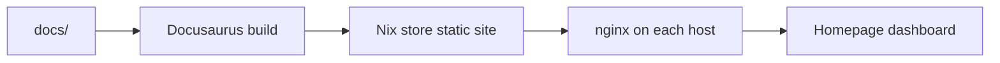

# Nixconf docs

These docs are the operational reference for this flake. They are intentionally small now; keep them accurate as the fleet changes.

## Current scope

- Source: `docs/`
- NixOS docs module: `modules/nixos/terminal/docs.nix`
- Dashboard integration: `modules/nixos/terminal/monitoring/homepage.nix`

## Upstream references

- [Docusaurus documentation](https://docusaurus.io/docs)
- [Docusaurus Markdown features](https://docusaurus.io/docs/markdown-features)
- [NixOS services.nginx options](https://search.nixos.org/options?query=services.nginx.virtualHosts)
