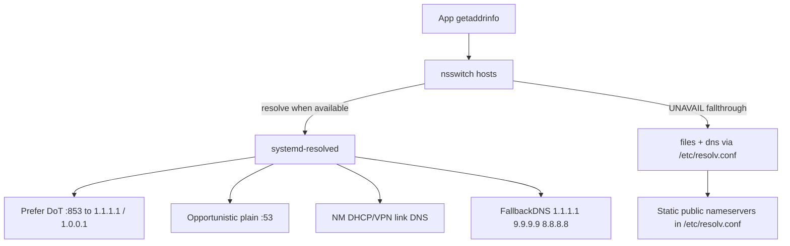

# DNS stack and emergency recovery

Owner module: [`modules/common/networking.nix`](https://github.com/matrix/nixconf/blob/main/modules/common/networking.nix).

This host prefers encrypted DNS to Cloudflare, but **never requires it**. If DoT, systemd-resolved, OpenSnitch, or a hotel middlebox fails, plain DNS and DHCP still work. Imperative recovery does **not** need a rebuild.

## Design (fail-open)



| Layer | Behavior | Why |
| --- | --- | --- |
| `services.resolved` | `DNSOverTLS=opportunistic`, `DNSSEC=no` | Prefer privacy; do not break captive portals |
| Global `nameservers` | `1.1.1.1#cloudflare-dns.com`, `1.0.0.1`, `9.9.9.9` | Preferred uplink when resolved is healthy |
| NM `dns = systemd-resolved` | DHCP/VPN DNS pushed as **link** DNS | Hotel captive portals keep working |
| `/etc/resolv.conf` | **Static public** `1.1.1.1`… — **not** `127.0.0.53` stub | Classic clients still resolve if resolved is dead |
| NSS | `resolve [!UNAVAIL=return] files myhostname dns` (NixOS default with resolved) | Use resolved when up; fall through when UNAVAIL |
| `FallbackDNS` | Public plain resolvers | Last resort inside resolved |
| `dns-emergency` | PATH helper | Imperative fix without rebuild |

Sources:

- [systemd-resolved(8) — `/etc/resolv.conf` modes](https://www.freedesktop.org/software/systemd/man/latest/systemd-resolved.service.html)
- [resolved.conf(5) — `DNSOverTLS=`, `FallbackDNS=`](https://www.freedesktop.org/software/systemd/man/latest/resolved.conf.html)
- [ArchWiki systemd-resolved](https://wiki.archlinux.org/title/Systemd-resolved#DNS)

## What we deliberately avoid

- **dnscrypt-proxy hard path** — extra daemon; if it dies with stub-only resolv.conf, the whole machine loses DNS.
- **Forcing `ignore-auto-dns` on every NM profile** — blocks captive-portal DHCP DNS.
- **Stub-only `/etc/resolv.conf` → `127.0.0.53`** — if `systemd-resolved` is missing/failed, every classic client hard-fails.
- **DNSSEC enforce / DoT enforce** — common captive-portal and TLS-intercept failures.

## Live checks

```bash
dns-emergency status
# or manually:
resolvectl status
cat /etc/resolv.conf
systemctl status systemd-resolved --no-pager
nmcli -g IP4.DNS,IP6.DNS dev show
getent hosts example.com
curl -fsS --connect-timeout 5 https://1.1.1.1/cdn-cgi/trace   # IP literal: path only
```

Healthy signals:

- `systemd-resolved` is `active`
- `resolvectl status` shows Cloudflare/global DNS and/or link DNS from the Wi‑Fi/Ethernet connection
- `getent hosts example.com` returns addresses
- `/etc/resolv.conf` lists public `nameserver` lines (not only `127.0.0.53`)

## Imperative recovery (no rebuild)

Tool installed by the networking module: **`dns-emergency`**.

### 0) Diagnose

```bash
dns-emergency status
```

### 1) Fastest: public plain DNS (works if resolved is dead)

Bypasses systemd-resolved for classic `/etc/resolv.conf` clients and for NSS `dns` fallthrough:

```bash
sudo dns-emergency plain
dns-emergency test
```

Equivalent one-liner if the tool is missing:

```bash
sudo tee /etc/resolv.conf >/dev/null <<'EOF'
nameserver 1.1.1.1
nameserver 1.0.0.1
nameserver 9.9.9.9
nameserver 8.8.8.8
options edns0
EOF
getent hosts example.com
```

### 2) Captive portal / hotel Wi‑Fi needs gateway DNS

```bash
sudo dns-emergency dhcp
# open a browser to a plain http:// site to trigger the portal
dns-emergency test
```

Manual equivalent: copy IPv4 DNS from `nmcli -g IP4.DNS dev show` into `/etc/resolv.conf` as `nameserver` lines.

### 3) resolved crashed, stuck, or running-but-broken

NSS uses `resolve [!UNAVAIL=return]`. If resolved is **running** but broken, glibc does **not** fall through to `/etc/resolv.conf`. Either fix resolved or stop it:

```bash
sudo dns-emergency restart-resolved
# still broken?
sudo dns-emergency stop-resolved   # writes public resolv.conf + stops resolved
dns-emergency test
# later:
sudo dns-emergency restore
```

### 4) DoT blocked / broken middlebox (resolved up, queries hang)

```bash
sudo dns-emergency disable-dot
dns-emergency test
```

Undo (or reboot — drop-in is under `/run`):

```bash
sudo rm -f /run/systemd/resolved.conf.d/99-dns-emergency-no-dot.conf
sudo systemctl restart systemd-resolved
```

### 5) Stale negative cache

```bash
sudo dns-emergency flush
```

### 6) Return to flake defaults after a manual hack

```bash
sudo dns-emergency restore
```

### 7) OpenSnitch is denying DNS

Resolved needs outbound **:53** and **:853**. Declarative rules live in `modules/common/networking.nix`. Temporary allow:

```bash
opensnitch-bypass -- curl -fsS https://example.com/
# or answer the UI prompt for systemd-resolved / your client
```

If you used `dns-emergency plain`, **apps** may query `1.1.1.1:53` directly and prompt once — allow, or use the bypass wrapper for the test.

### 8) Nuclear: resolved unit missing on a pre-switch generation

This generation may predate `services.resolved.enable`. Public `/etc/resolv.conf` still works after `plain`. To get resolved without a full desktop session:

```bash
sudo dns-emergency plain
# then rebuild/switch when convenient — do not block internet on that
```

## Failure matrix

| Symptom | Likely cause | Fix |
| --- | --- | --- |
| Nothing resolves; `resolvectl` connection refused | resolved down/missing | `sudo dns-emergency plain` (already default) then `restart-resolved` |
| resolved active but nothing resolves | OpenSnitch/DoT/path broken while NSS pins resolved | `sudo dns-emergency stop-resolved` or `disable-dot` / fix OpenSnitch |
| Resolves on phone hotspot, not hotel Wi‑Fi | captive portal needs DHCP DNS | `sudo dns-emergency dhcp`, open portal in browser |
| Hangs then works slowly | DoT blocked, plain fallback slow | `sudo dns-emergency disable-dot` or `plain` |
| Only some apps break | OpenSnitch deny | allow rule / `opensnitch-bypass` |
| IPv6 sites hang | broken IPv6 path | gai IPv4 preference is already set; VPN dispatcher drops bad tun v6 |
| After VPN, dual-stack apps broken | IPv6 full-tunnel without GUA | automatic `vpn-drop-broken-ipv6` dispatcher; reconnect VPN |

## After rebuild

`switch` re-applies the flake `environment.etc."resolv.conf".text` (public fail-open) and resolved settings. Temporary `/run` DoT drop-ins disappear on reboot; a written `/etc/resolv.conf` from `plain`/`dhcp` is replaced on the next activation that manages that file.

## Related

- OpenSnitch DNS rules: [opensnitch.md](./opensnitch.md)
- Topology blurb: repo root `AGENTS.md` Navigation / Live Topology
