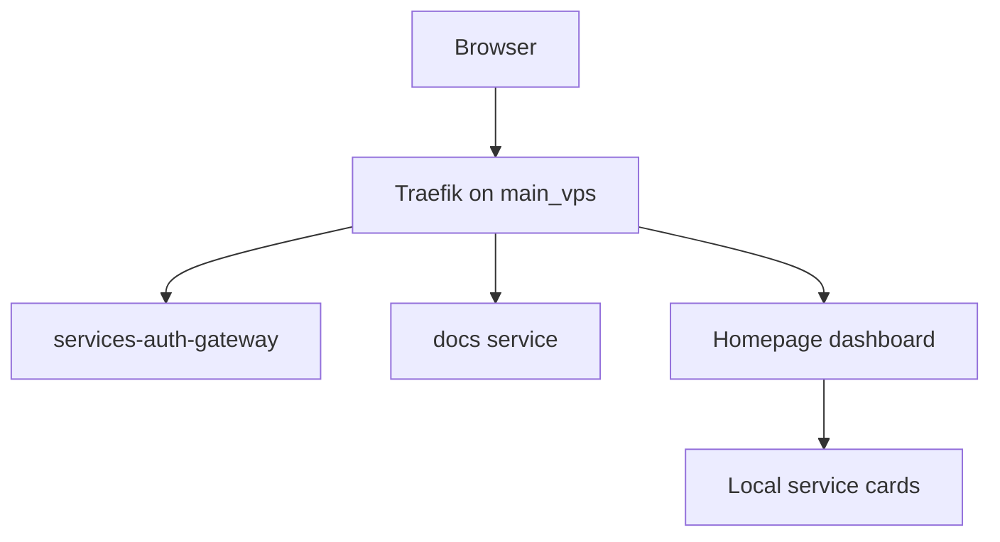

# Public routes and dashboards

`main_vps` owns public edge routing. Local hosts serve dashboards over Tailscale/local hostnames.



## Local docs service

- Module: `modules/nixos/terminal/docs.nix`
- Default bind: `127.0.0.1:8090`
- Local shortcut: `http://docs/` on hosts using the Homepage local magic DNS proxy.
- Public route: `https://docs.<PUBLIC_BASE_DOMAIN>/` on `main_vps`.

```nix
services.nixconf-docs = {
  enable = true;
  host = "127.0.0.1";
  port = 8090;
};
```

## Homepage integration

Homepage cards come from `modules/nixos/terminal/monitoring/homepage.nix`. Add a local service entry when a service should appear on every host that enables it.

## References

- [Homepage configuration docs](https://gethomepage.dev/configs/)
- [Traefik HTTP routers](https://doc.traefik.io/traefik/routing/routers/)
- [NixOS nginx module options](https://search.nixos.org/options?query=services.nginx)
