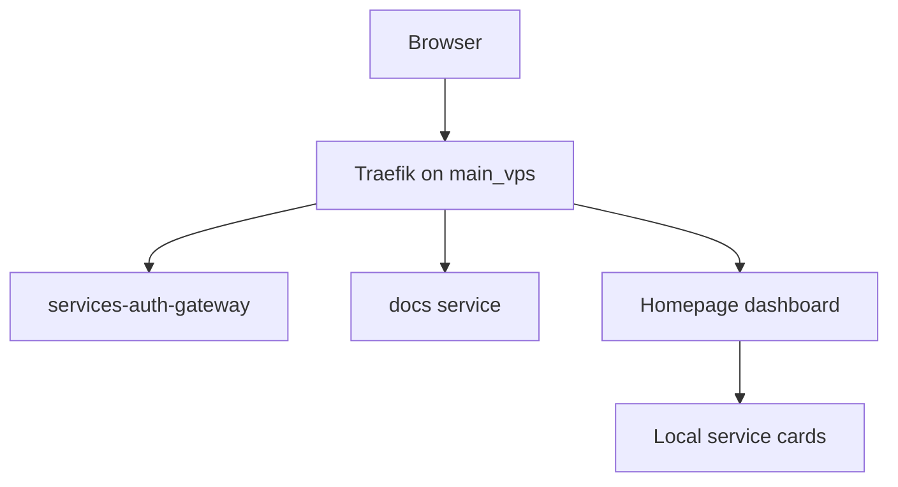

# Public routes and dashboards

`main_vps` owns public edge routing. Local hosts serve dashboards over Tailscale/local hostnames.



## Local docs service

- Module: `modules/nixos/terminal/docs.nix`
- Default bind: `127.0.0.1:8090`
- Local shortcut: `http://docs/` on hosts using the Homepage local magic DNS proxy.
- Public route: `https://docs.<PUBLIC_BASE_DOMAIN>/` on `main_vps`.

```nix
services.nixconf-docs = {
  enable = true;
  host = "127.0.0.1";
  port = 8090;
};
```

## Homepage integration

Homepage cards come from `modules/nixos/terminal/monitoring/homepage.nix`.

One `serviceCatalog` drives:

- local magic-DNS cards (`http://<name>/`) when the service is enabled on the host
- public edge cards (`https://<subdomain>.<PUBLIC_BASE_DOMAIN>/`)
- nginx/Traefik loopback proxies and `/etc/hosts` aliases
- fleet host bookmarks

Every card description ends with a uniform port badge (`· :8082`). Icons use
Dashboard Icons brand marks where available, otherwise colored `mdi-`/`si-`
icons. Theme is **Nix Cyberpunk Electric Dark** via Homepage `customCSS`
(cyan/magenta neon on a void grid).

### Service widgets

| Service | Widget | Credentials |
| --- | --- | --- |
| Portainer (local hosts with stack) | running / stopped / total containers | `self.secrets.PORTAINER_API_KEY` → `HOMEPAGE_VAR_PORTAINER_KEY`; endpoint id `services.homepage-monitor.portainerEnv` (default `3`) |
| qBittorrent (desktop Gluetun stack) | leech / download / seed / upload | `QBITTORRENT_WEBUI_{USERNAME,PASSWORD}` via Homepage env placeholders |

Portainer API key lives in password-store at `system/portainer-api-key` and is
fetched by `rebuild.sh` into `secrets.nix`. Create a key in Portainer under
User → Account → API tokens if rotated.

### Resource widgets

Header widgets are split into labeled groups: **Compute** (CPU, temp, memory,
uptime), **Storage** (`/` + `/persist`), and **Network**, plus datetime and
DuckDuckGo search.

Add a catalog entry in `homepage.nix` when a service should appear on every host
that enables it.

## References

- [Homepage configuration docs](https://gethomepage.dev/configs/)
- [Homepage Portainer widget](https://gethomepage.dev/widgets/services/portainer/)
- [Homepage resources widget](https://gethomepage.dev/widgets/info/resources/)
- [Traefik HTTP routers](https://doc.traefik.io/traefik/routing/routers/)
- [NixOS nginx module options](https://search.nixos.org/options?query=services.nginx)
