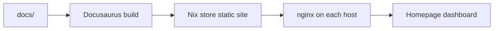

# Nixconf docs

These docs are the operational reference for this flake. Keep them accurate as the fleet changes and keep the docs tree content-only: first-level entries under `docs/` are section directories, and those sections contain `.md`/`.mdx` files only. Docusaurus JS/TS code lives in `packages/bunjs-docs/`.

## Current scope

- Source: `docs/`
- NixOS docs module: `packages/bunjs-docs/module.nix`
- Dashboard integration: `modules/terminal/monitoring/homepage.nix`

## Repository architecture

- `lib/`: flat `*.nix` helpers for persistence, nixpkgs policy, package discovery, config files, git rendering, and user package-manager paths.
- `packages/<name>/`: in-repo software with isolated package metadata and lockfiles; package-owned modules live beside the package.
- `external-packages/<name>/`: packaged upstream projects. `external-packages/update-pkgs/workflow.nix` owns automatic or documented-manual update coverage and warns when a package is uncovered.
- `programmes/<name>/`: wrapper-first portable configured upstream-tool packages built with [`nix-wrapper-modules`](https://birdeehub.github.io/nix-wrapper-modules/md/intro.html). Check nixpkgs, then flake inputs such as [`llm-agents`](https://github.com/numtide/llm-agents.nix), before local packaging; use an owner-matching `<name>.nix` wrapper such as [`programmes/herdr/herdr.nix`](../../programmes/herdr/herdr.nix) when needed. An exported wrapper is neither enabled nor installed until a consumer selects it; reserve `packages/` for in-repo software and `external-packages/` for genuinely needed upstream packaging.
- `modules/`: reusable NixOS profiles, features, and services; host decisions flow through `preferences`.
- `hosts/<name>/`: concrete machines and hardware/disko configuration.

The impermanence module sets trash support on persisted bind mounts and keeps `~/.local/share/Trash` in cache-tier persistence, so GUI deletes from the checkout go to the global XDG trash rather than `.Trash-*` in the repository root.

## Upstream references

- [Docusaurus documentation](https://docusaurus.io/docs)
- [Docusaurus Markdown features](https://docusaurus.io/docs/markdown-features)
- [NixOS services.nginx options](https://search.nixos.org/options?query=services.nginx.virtualHosts)
- [nix-wrapper-modules](https://birdeehub.github.io/nix-wrapper-modules/md/intro.html)
- [llm-agents](https://github.com/numtide/llm-agents.nix)
- [Herdr](https://github.com/numtide/herdr)
